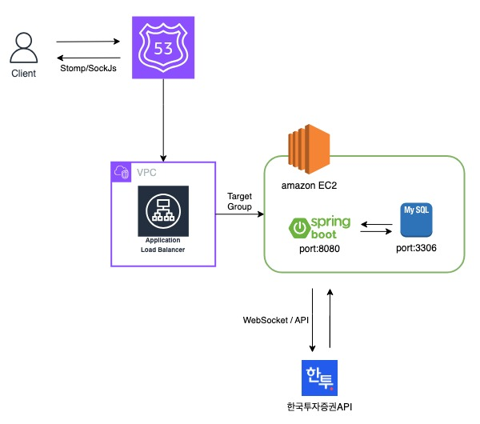
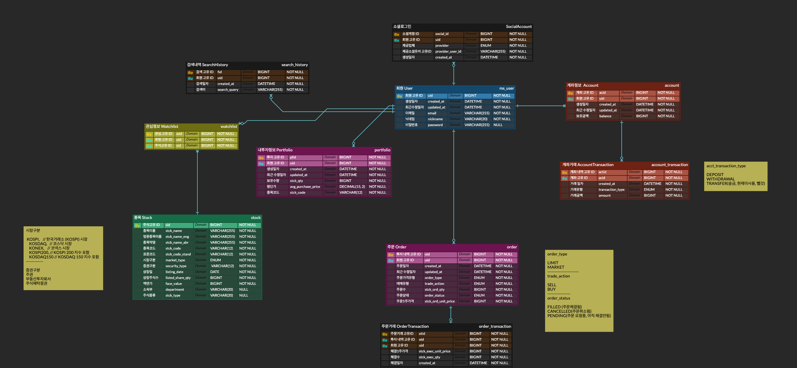
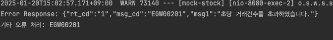

## 프로젝트 소개
실제 주식 투자에는 자산 손실에 대한 리스크가 있어, 처음 시작하기 어렵고 쉽게 경험을 쌓기 힘듭니다.  
이에 따라, 가볍게 시작하면서도 자신만의 투자 가치를 키워갈 수 있는 **모의 주식 투자 플랫폼**을 기획하게 되었습니다.

이 서비스는 투자 경험이 부족한 사용자들이 **리스크 없이 전략을 실험하고**,  
**거래를 기록하고 복기**하면서 투자 감각을 키울 수 있도록 설계되었습니다.

또한 **한국투자증권 OpenAPI**를 연동하여 **실시간 시세 반영**, **가상 주문 처리**, **잔고 및 거래 내역 기록** 등의 기능을 제공합니다.

## 사용 기술
- **Language & Frameworks**: Java 21, Spring Boot 3.3.6
- **Database**: MySQL
- **ORM & Persistence**: Spring Data JPA
- **API & Network**: RESTful API, WebSocket (STOMP)
- **API Docs**: Swagger (SpringDoc OpenAPI 2.6.0)
- **Security**: Spring Security, JWT
- **Build Tool**: Gradle

## 아키텍처

## 주요 기능
- 사용자 인증/인가 (JWT 기반)
- 계좌 등록 및 잔고 확인
- 주식 매수 / 매도 / 주문 취소 처리
- 한국투자증권 WebSocket 연동 기반 실시간 시세 전송
- 투자 포트폴리오 조회
- 거래 내역 조회

## ERD

원본: https://www.erdcloud.com/d/TiBLG8nW8FK5pMGSv

- **User**: 회원 가입 정보 및 인증에 사용
- **Account**: 각 사용자의 모의 투자 계좌
- **Order**: 주문 내역 (시장가 / 지정가, 매수 / 매도)
- **OrderTransaction**: 체결된 거래 내역
- **AccountTransaction**: 입출금, 이체 내역 관리
- **Portfolio**: 보유 주식 평균 단가 및 수량 관리
- **Watchlist**: 관심 종목 등록 및 조회 기능
- **Stock**: 주식 종목 정보 및 시세
- **SearchHistory**: 종목 검색 기록
- **SocialAccount**: 소셜 로그인 연동 정보(현재 카카오만 가능)

## Trouble Shooting
* 한국투자증권 API 초당 요청건 제한으로 인해 한번에 여러번 요청시 에러발생하는 상황이였고 외부 API 이기떄문에 에러나지 않는 초당 요청을 수정필요한 상황

**[에러 스크린샷]**

- **해결: Synchronized + Lock + sleep**

  Synchronized 와 Lock을 이용해 해당부분이 끝날때까지 같은 블록안에 들어와서 실행하지못하도록 하는 방법인데 보통 정합성이나 동시성이슈가 있을때 이를 사용한다고한다. 하지만 나의이슈는 트래픽 딜레이를 위한것이였고 이를위해 sleep까지 추가하였다. 처음에는 컨트롤러에서 Synchronized를 걸어주었는데 서비스 전반적으로 한투 api 이용하는 부분들이 많아 해당부분마다 모두 sync 걸어주기에는 유지보수성이나 실수가 생길수있는 확률이 높다고 생각들었고, 차라리 비즈니스적으로 api를 호출하는 부분(서비스계층)의 코드만 sync걸어준다면 해당부분만 직렬처리되고 나머지는 병렬처리가 가능하고 유지보수도 용이하여 그렇게 리펙토링 작업하였다.

 - **고민해본것**:

   1. *생산자-소비자패턴(Queue + Thread + sleep)* : Synchronized + Lock + sleep 으로할시 동시 요청자가 많을수록 응답이 점점 늦어짐(특히 매수매도 부분에서는 가상이더래도 거래가 이루워지는 부분에서 느리다면 치명적), 따라서 Synchronized + Lock + sleep가아닌 Queue Thread 소비자패턴 + sleep을 이용하여 순차진행을 하되 먼저 응답을 빠르게 해놓고 추후 queue에 맞춰서 진행하는걸로 해결하려하였음 → 문제는 미리 처리요청완료까지는 좋지만 실제 금액부족, 수량부족 또는 다른 예외발생시 이를 캐치해서 클라이언트에게 상태코드를 내려줄수없게되는 이슈가있어서 결국 이 방법또한 하지않게됨
   
   2. *스프링 배치* : 요청에 대해서 하나하나 요청하지말고 한번에 묶어서 요청하면 어떨까 생각해보았지만 같은 요청이 아닌 요청 파라미터(날짜, 종목)가 다르기 때문에 묶을수가없다.
   3. *캐시 처리* : Redis를 이용하여 중복되는 요청에 대해서는 캐시로 저장후 같은 요청이 오면 캐시를 사용하면 어떨까 생각해보았다. 하지만 실시간 시세에서 날짜, 시간 모두 다르고 몇천개의 주식에 대한 캐시를 다 넣는다는거가 불가능 하였다.
   
 